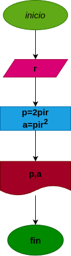

# Programa#1
programa para calcular el area y el perimetro de un circulo de radio r

# Analisis

## Input
### Variables de entrada
r: radio del circulo
### Processing
p: perimetro del circulo
p=2πr

a: area del circulo
a=πrr

### Output
a,p
# Diseño

# Construccion
